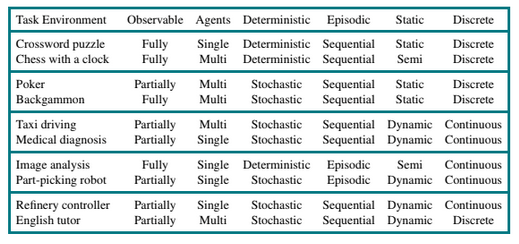

# RPS
Juego de RPS (Piedra-Papel-Tijeras, por sus siglas en inglés) extendido para incluir las nuevas reglas de Lagarto y Spock (RPSLS).

El juego utiliza un modelo simple para predecir tu siguiente movimiento en función de los anteriores.

## Propiedades del modelo

Según la siguiente tabla podemos determinar las propiedades de nuestro modelo:

 | Observable | Axentes | Determinista | Episódico | Estático | Discreto | Coñecido
 | :---: | :---: | :---: | :---: | :---: | :---: | :---: |
 | Parcial | Multiagente | Estocaistico | Episódico | Estático |  Discreto | Conocido |

 - Parcial: El agente no sabe el estado completo del entorno, sólo conoce el resultado al final cuando se revela la elección del jugador
 - Multiagente: El jugador también está intentado maximizar su rendimiento
 - Estocaistico: El agente no puede determinar con seguridad el siguiente estado a partir de lo que observa
 - Episódico: El agente toma una decisión al empezar el turno
 - Estático: El entorno se mantiene costante mientras el agente está seleccionando una acción
 - Discreto: El entorno tiene una serie finita de estados en los que puede encontrarse
 - Conocido: El agente conoce las reglas para poder jugar al juego

## Estructura del agente

El agentes es un agente reactivo basado en modelos, ya que cuenta con un historial de los estados previos del entorno y realiza sus decisiones con esa información. Su estructura es la siguiente:

